# VPN Client-To-Site — FortiGate SSL VPN

**Alumno:** Junior Javier Santos Perez  
**Matrícula:** 2024-1599  
**Plataforma:** PNETLab  

Video demostrativo:https://www.youtube.com/watch?v=gN6pCrQpClw 


---

## Objetivo

Configurar una VPN Client-to-Site usando SSL VPN en FortiGate-VM64-KVM v7.0.3, permitiendo que un cliente Linux remoto establezca un túnel cifrado hacia la red interna, logrando conectividad con dispositivos en la LAN protegida (`10.15.99.0/24`) desde una red externa (`192.168.129.0/24`).

---

## Topología

```
         Cloud/NAT (192.168.129.0/24 - Altice)
                |                    |
        192.168.129.154          192.168.129.155
           FortiGate                Linux (Cliente VPN)
           10.15.99.1            IP Túnel: 10.212.134.200
                |
           10.15.99.2
              VPC
```

| Equipo | Interfaz | IP | Rol |
|--------|----------|-----|-----|
| FortiGate | port1 | 192.168.129.154/24 (DHCP) | WAN — hacia Internet |
| FortiGate | port2 | 10.15.99.1/24 | LAN interna |
| VPC | eth0 | 10.15.99.2/24 | Host interno protegido |
| Linux (Kali) | eth0 | 192.168.129.155/24 | Cliente VPN remoto |
| Linux (Kali) | ppp0 | 10.212.134.200/32 | Interfaz de túnel VPN |

**IMAGEN1 — Topología del laboratorio en PNETLab:**

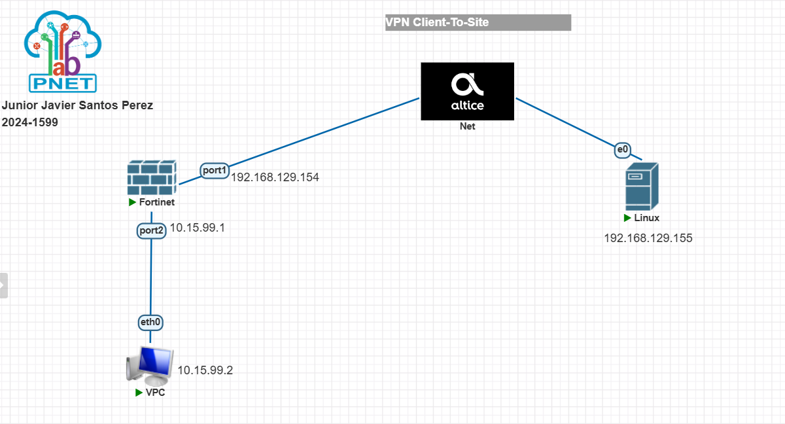

---

## Configuración FortiGate

### Interfaces de red

`port1` en modo DHCP obtiene IP de la nube NAT. `port2` con IP estática para la LAN interna.

```bash
config system interface
    edit "port1"
        set mode dhcp
        set allowaccess ping https ssh
    next
    edit "port2"
        set ip 10.15.99.1 255.255.255.0
        set allowaccess ping https ssh
    next
end
```

**IMAGEN11 — Interfaces port1 (DHCP 192.168.129.154) y port2 (10.15.99.1) activas:**

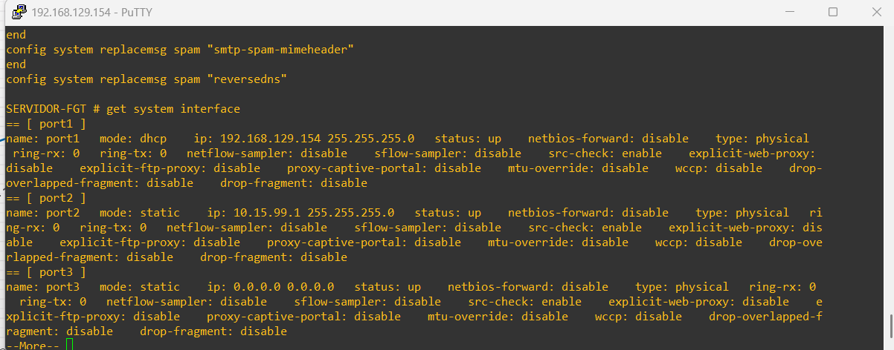

---

### Pool de IPs para clientes VPN

Rango de IPs que el FortiGate asignará a los clientes conectados por SSL VPN.

```bash
config firewall address
    edit "SSLVPN_TUNNEL_ADDR1"
        set type iprange
        set start-ip 10.212.134.200
        set end-ip 10.212.134.210
    next
end
```

---

### Portal SSL VPN

Se editó el portal `full-access` habilitando modo túnel. El split-tunneling se deshabilitó para que todo el tráfico del cliente pase por el túnel cifrado.

```bash
config vpn ssl web portal
    edit "full-access"
        set ip-pools "SSLVPN_TUNNEL_ADDR1"
        set tunnel-mode enable
        set split-tunneling disable
    next
end
```

**IMAGEN8 — Portal `full-access` con tunnel-mode habilitado y split-tunneling deshabilitado:**

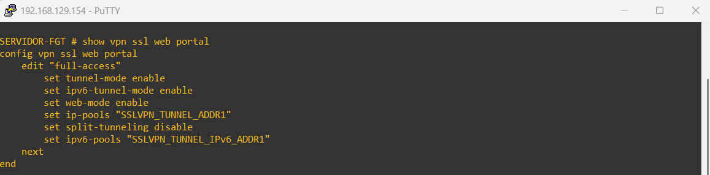

---

### Servicio SSL VPN

Se configuró el servicio SSL VPN en puerto 443 usando `port1` como interfaz WAN y el portal `full-access`.

```bash
config vpn ssl settings
    set servercert "Fortinet_Factory"
    set tunnel-ip-pools "SSLVPN_TUNNEL_ADDR1"
    set port 443
    set source-interface "port1"
    set source-address "all"
    set default-portal "full-access"
end
```

**IMAGEN7 — Configuración SSL VPN: puerto 443, interfaz port1, portal full-access:**

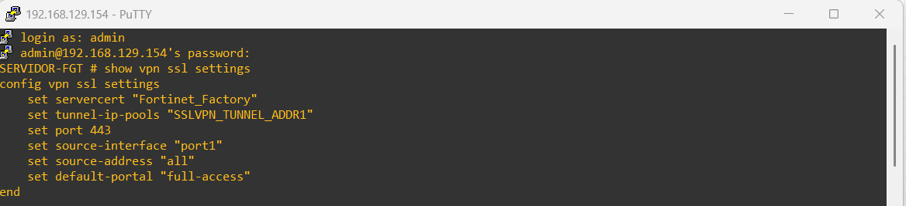

---

### Usuario y grupo VPN

Se creó el usuario `vpnuser` y el grupo `sslvpn-group` para controlar el acceso al túnel.

```bash
config user local
    edit "vpnuser"
        set type password
        set passwd MiClaveSegura123
    next
end

config user group
    edit "sslvpn-group"
        set member "vpnuser"
    next
end
```

---

### Políticas de firewall

Política 1 permite tráfico del túnel VPN hacia la LAN interna. Política 2 permite a la LAN acceder a Internet.

```bash
config firewall policy
    edit 1
        set name "SSLVPN-to-LAN"
        set srcintf "ssl.root"
        set dstintf "port2"
        set srcaddr "all"
        set dstaddr "all"
        set action accept
        set schedule "always"
        set service "ALL"
        set groups "sslvpn-group"
        set nat enable
    next
    edit 2
        set name "LAN-to-WAN"
        set srcintf "port2"
        set dstintf "port1"
        set srcaddr "all"
        set dstaddr "all"
        set action accept
        set schedule "always"
        set service "ALL"
        set nat enable
    next
end
```

**IMAGEN9 — Políticas SSLVPN-to-LAN y LAN-to-WAN configuradas:**

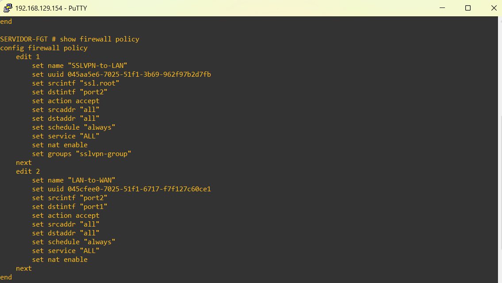

---

## Configuración Cliente Linux

### Problema encontrado

La versión estándar de `openfortivpn` en Kali usa OpenSSL 3.5.5 que rechaza TLS 1.0/1.1. FortiGate 7.0.3 negocia con versiones antiguas de TLS causando el error `tlsv1 alert protocol version`. La solución fue compilar `openfortivpn` desde código fuente con un parche que permite TLS 1.0.

### Compilación desde código fuente

```bash
sudo apt install -y autoconf automake libssl-dev pkg-config ppp git
git clone https://github.com/adrienverge/openfortivpn.git
cd openfortivpn

# Parche para permitir TLS 1.0
sed -i 's/if (tunnel->config->min_tls > 0) {/if (tunnel->config->min_tls > 0) {\n\t\t\tif (tunnel->config->min_tls > TLS1_VERSION)\n\t\t\t\ttunnel->config->min_tls = TLS1_VERSION;/' src/tunnel.c

./autogen.sh
./configure --prefix=/usr/local --sysconfdir=/etc
make
sudo make install
```

### Bajar restricciones TLS en OpenSSL

Editar `/etc/ssl/openssl.cnf` y modificar:

```
[system_default_sect]
MinProtocol = TLSv1.0
CipherString = DEFAULT:@SECLEVEL=0
```

### Conectar al túnel VPN

```bash
sudo openfortivpn 192.168.129.154:443 -u vpnuser \
  --insecure-ssl \
  --trusted-cert 286efc05555bc05560acbbb14928b35b93b7da0e6a47e1a6701bc983704f1190
```

**IMAGEN12 — Proceso de conexión: autenticación exitosa y asignación de VPN:**

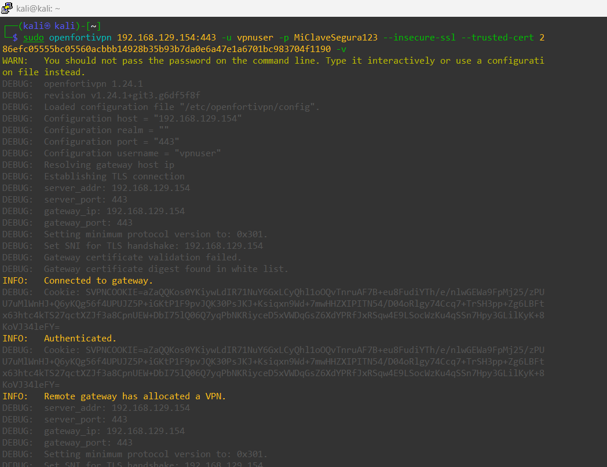

**IMAGEN13 — Túnel activo con tráfico fluyendo y desconexión limpia:**

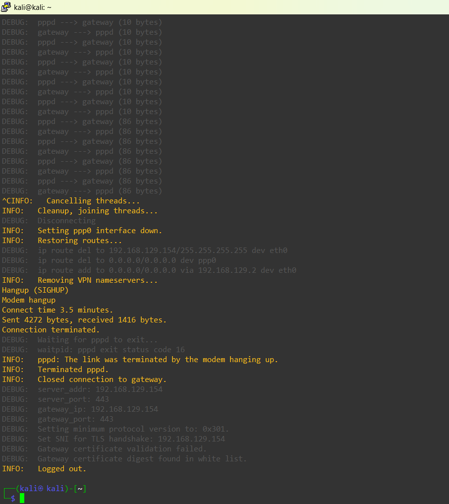

---

## Pruebas de Conectividad

### Traceroute SIN VPN — debe fallar

Sin VPN los paquetes llegan al gateway `192.168.129.2` pero no pueden alcanzar la LAN interna, mostrando `* * *` en todos los saltos siguientes.

```bash
traceroute 10.15.99.2
```

**IMAGEN2 — Traceroute sin VPN: sin ruta hacia 10.15.99.2:**

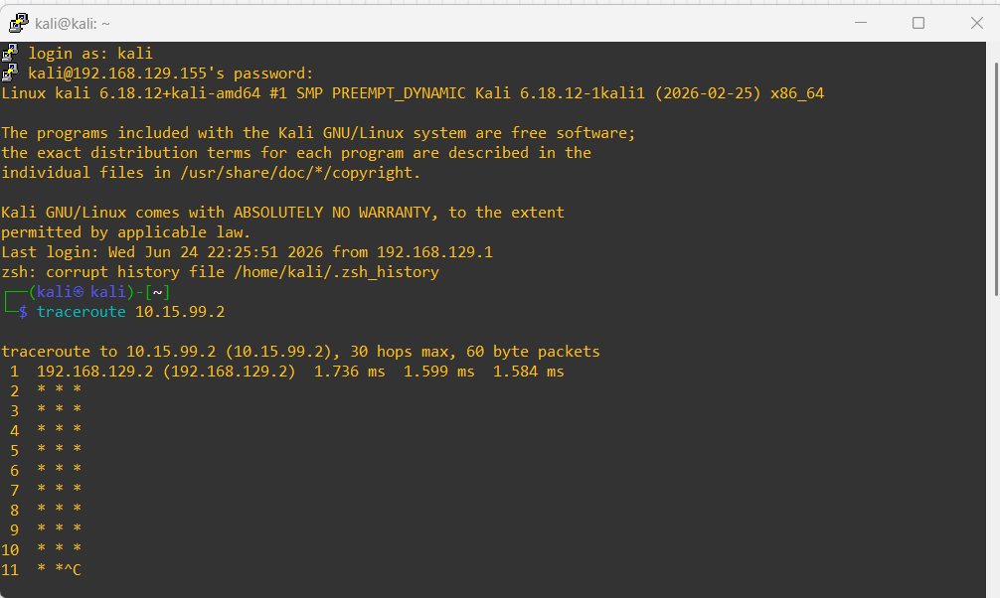

---

### Traceroute CON VPN — debe funcionar

Con el túnel activo los paquetes viajan por `ppp0` y llegan al destino en 2 saltos.

```bash
traceroute 10.15.99.2
```

**IMAGEN3 — Traceroute con VPN: llega a 10.15.99.2 en 2 saltos:**

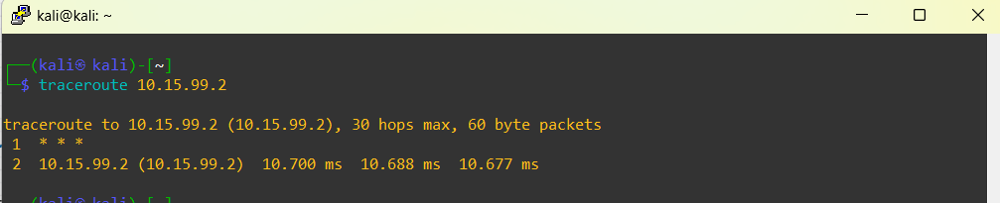

---

### Interfaz ppp0 y tabla de rutas

Confirma que se creó la interfaz `ppp0` con IP `10.212.134.200` asignada por el FortiGate y que el default route apunta al túnel.

```bash
ip a show ppp0 && ip route
```

**IMAGEN4 — Interfaz ppp0 UP con IP 10.212.134.200 y default route por el túnel:**

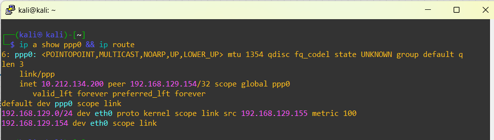

---

### Ping CON VPN — debe funcionar

Acceso exitoso al host interno `10.15.99.2` a través del túnel con 0% pérdida de paquetes.

```bash
ping -c 3 10.15.99.2
```

**IMAGEN5 — Ping exitoso a 10.15.99.2 con VPN activa, TTL=63, ~3-6ms:**

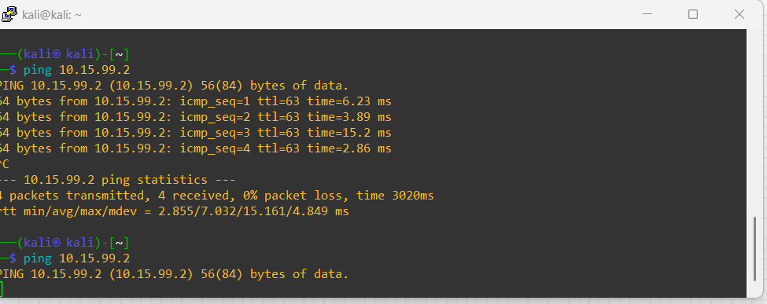

---

### Configuración VPC interna

**IMAGEN6 — VPC con IP 10.15.99.2/24 y gateway 10.15.99.1:**

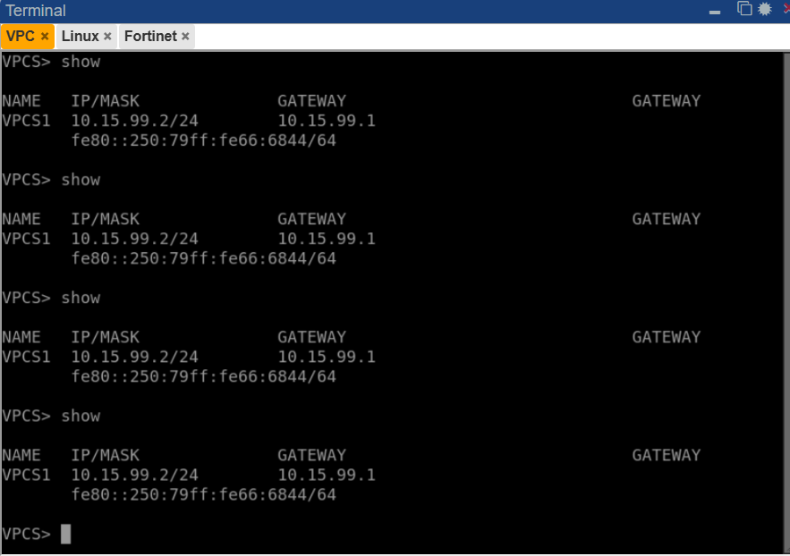

---

### Monitor de sesiones activas en FortiGate

Muestra en tiempo real los clientes conectados con usuario, IP origen e IP de túnel asignada.

```bash
get vpn ssl monitor
```

**IMAGEN10 — Usuario vpnuser conectado desde 192.168.129.155 con IP de túnel 10.212.134.200:**

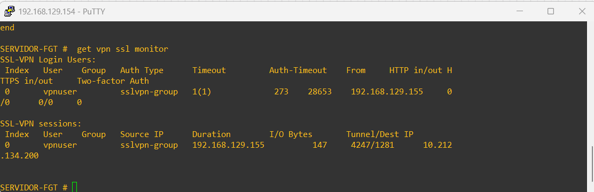

---

## Resumen de Resultados

| Prueba | Sin VPN | Con VPN |
|--------|---------|---------|
| `traceroute 10.15.99.2` | ❌ Sin ruta — `* * *` | ✅ 2 saltos, llega al destino |
| `ping 10.15.99.2` | ❌ 100% pérdida | ✅ 0% pérdida, ~3-6ms |
| Interfaz `ppp0` | ❌ No existe | ✅ UP con IP `10.212.134.200` |
| Sesión en FortiGate | ❌ Sin sesiones | ✅ `vpnuser` activo |


Esta práctica fue realizada en un entorno simulado y controlado con fines exclusivamente educativos. Las actividades desarrolladas tienen como único propósito el aprendizaje y la demostración de conceptos técnicos.
